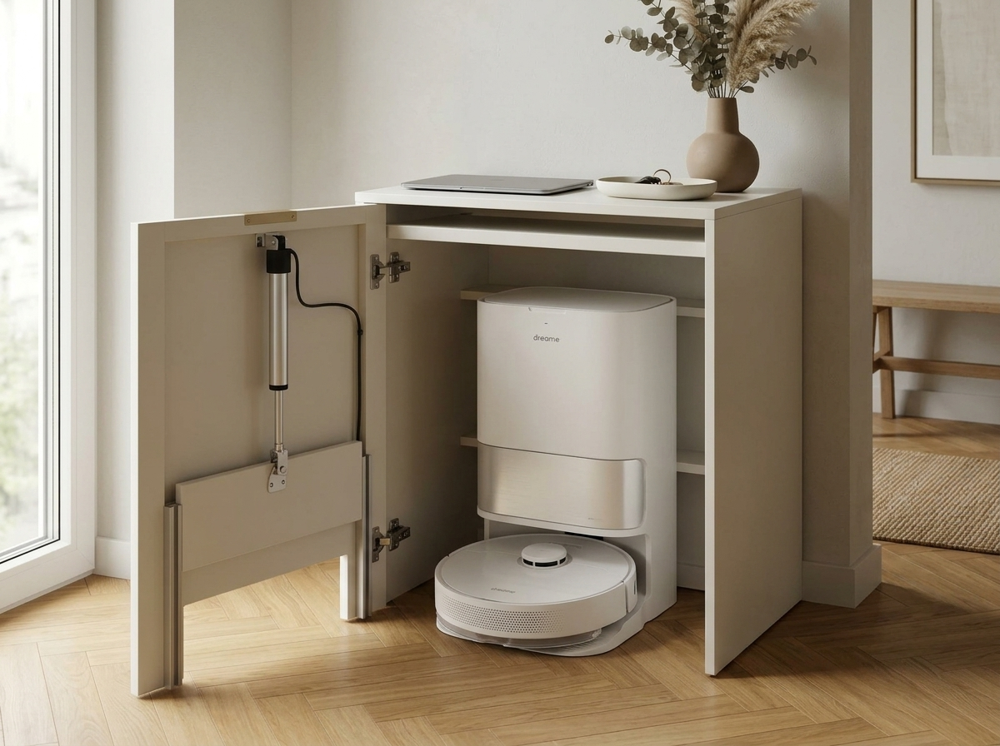
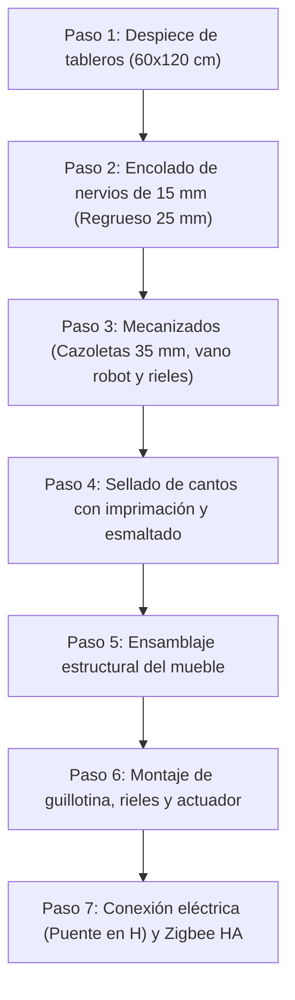

# Mueble Recibidor Automatizado a Cota Cero para Robot Aspirador

Consola de entrada minimalista a medida diseñada para ocultar la estación de autovaciado y robot aspirador **Dreame (L10s / X40)** a **Cota Cero**, con compuerta tipo guillotina automatizada mediante **Micro Actuador Lineal 12V** y control nativo por **Zigbee (Home Assistant)**.

| Vista Exterior (Puerta Cerrada / Salida Robot) | Vista Mecanismo Interior (Puerta Abierta) |
| :---: | :---: |
|  |  |

---

## 1. Planos Técnicos Limpios

### 1.1. Plano de Cotas Milimétricas (Alzado Interior con Puerta Abierta)
> Archivo de alta resolución: [`render_mueble_realista_cotas.jpg`](render_mueble_realista_cotas.jpg)


### 1.2. Plano Wireframe CAD (Secciones Interiores y Transparencia)
> Archivo de alta resolución: [`render_mueble_wireframe.jpg`](render_mueble_wireframe.jpg)


---

## 2. Dimensiones Generales del Mueble

| Cota | Medida | Justificación Técnica |
| :--- | :---: | :--- |
| **Ancho exterior** | **480 mm** | Deja un hueco interior libre de **430 mm** (la base Dreame mide 423 mm, holgura de 3,5 mm por lado). |
| **Alto exterior** | **790 mm** | Altura estricta de consola recibidor (bajo la cintura), optimizada para apoyo de portátil y llaves. |
| **Fondo exterior** | **560 mm** | Alberga los 493 mm de la base con rampa + 20 mm de cables + 47 mm libres para compuerta y actuador. |
| **Vano paso robot** | **390 x 117 mm** | Cajeado en "U" a ras de suelo con montantes laterales de 45 mm. Holgura de +20 mm lateral y superior. |
| **Compuerta guillotina**| **410 x 140 mm** | Panel deslizante interior de 10 mm guiado por perfiles de aluminio de 20 mm. |
| **Ranura superior útil**| **40 mm libres** | Espacio estrecho bajo la encimera para bayetas, mopas planas y recambios. |
| **Margen depósitos agua**| **132 mm libres** | Distancia entre la estación Dreame (568 mm) y la balda (700 mm) para retirar tanques verticalmente. |

---

## 3. Componentes Exactos Comprados (Lista de Materiales BOM)

### 3.1. Carpintería y Acabados
* **5x Tablero de contrachapado crudo $60 \times 120 \times 1,0\text{ cm}$** (Paneles base estructurales).
* **2x Tablero de contrachapado crudo $60 \times 120 \times 1,5\text{ cm}$** (Tiras de $50\text{ mm}$ para nervios perimetrales de regrueso a 25 mm).
* **1x Imprimación universal LUXENS 1 L** (Sellador/tapaporos para cantos y caras).
* **1x Esmalte de interior ecológico TITANLUX blanco satinado 750 ml** (RAL 9010).
* Cola blanca de carpintero (D3) y tornillos para madera de $3,5 \times 16\text{ mm}$ y $3,5 \times 20\text{ mm}$.

### 3.2. Mecanismo y Automatización
* **1x Micro Actuador Lineal Eléctrico Mini 12V DC, 150N, carrera 150 mm** (cuerpo tubular delgado $< 35\text{ mm}$, velocidad $12-15\text{ mm/s}$).
* **1x Módulo Relé Inteligente ZigBee 2 Canales MHCOZY** (85-250V AC / 5V USB, con contactos secos y modo *Interlock*).
* **1x Fuente de alimentación 230V AC a 12V DC** (estabilizada, $\ge 2\text{A}$).
* **2x Perfiles en "U" de aluminio anodizado $20 \times 15 \times 1,5\text{ mm}$** (longitud $280\text{ mm}$).
* **2x Bisagras de cazoleta gran angular $165^\circ - 170^\circ$ solape total** (cazoleta $\varnothing 35\text{ mm}$).
* **2x Escuadras metálicas de fijación** con pasadores/tornillos M6 para los extremos del actuador.
* Tira de fieltro o teflón adhesivo de 1 mm para el interior de los rieles.

---

## 4. Procedimiento de Construcción Paso a Paso



---

### Paso 1: Despiece y Corte de Tableros ($60 \times 120\text{ cm}$)

Corta las piezas base con escuadradora o sierra circular con guía:

#### Tableros de 10 mm (Paneles base)
* **Lámina 1 (10 mm)**:
  * 1x **Costado izquierdo**: **$765 \times 535\text{ mm}$**.
  * Del retal sobrante ($435 \times 600\text{ mm}$): cortar la **Compuerta guillotina** (**$410 \times 140\text{ mm}$**).
* **Lámina 2 (10 mm)**:
  * 1x **Costado derecho**: **$765 \times 535\text{ mm}$**.
* **Lámina 3 (10 mm)**:
  * 1x **Encimera superior**: **$480 \times 535\text{ mm}$**.
  * 1x **Balda interior**: **$430 \times 530\text{ mm}$** *(caben ambas a lo largo: $535 + 530 = 1065\text{ mm} \le 1200\text{ mm}$)*.
* **Lámina 4 (10 mm)**:
  * 1x **Puerta frontal**: **$480 \times 790\text{ mm}$**.
* **Lámina 5 (10 mm)**: Tablero de reserva.

#### Tableros de 15 mm (Nervios de regrueso)
* Corta los 2 tableros longitudinalmente en **tiras de $50\text{ mm}$ de ancho** ($1200\text{ mm}$ de largo). Se obtienen más de 20 metros lineales de listones de refuerzo.

---

### Paso 2: Encolado de Nervios de 15 mm (Regrueso a 25 mm)

La técnica consiste en pegar tiras de 15 mm en el perímetro interior de los paneles de 10 mm para lograr un borde exterior de **25 mm de espesor**:

1. **Ubicación de las tiras**:
   * **Costados (x2)**: Encolar tiras de 50 mm enrasadas a los 4 cantos perimetrales por la cara interior.
   * **Encimera (x1)**: Encolar tiras en los bordes frontal, izquierdo y derecho por la cara inferior.
   * **Balda (x1)**: Encolar tira en el canto frontal visto.
   * **Puerta (x1)**: Encolar tiras en los 4 bordes interiores (especialmente crítico en el montante izquierdo para las bisagras y en los laterales para los rieles de la guillotina).
2. **Prensado**: Aplica cola blanca generosa, fija con sargentos o peso repartido y deja secar 45 minutos.
3. **Lijado de igualación**: Pasa un taco de lija de grano **P150** por los cantos para nivelar la unión de los dos tableros ($10 + 15\text{ mm}$). Debe quedar al tacto como un único bloque sólido de 25 mm.

---

### Paso 3: Mecanizados Críticos

*Realiza todos los cajeados antes de aplicar pintura:*

1. **Cazoletas de bisagras ($\varnothing 35\text{ mm}$)**:
   * En la cara interior de la puerta (montante izquierdo), marca los centros de las 2 bisagras a 100 mm de los extremos superior e inferior.
   * Con broca Forstner de 35 mm, fresa a **$11,5 - 12\text{ mm}$ de profundidad**.
   * *Seguridad*: Al taladrar sobre el nervio de 15 mm encolado al tablero de 10 mm (25 mm en total), quedan 13 mm de margen y no hay riesgo de perforar el frontal visto.
2. **Cajeado vano robot ($390 \times 117\text{ mm}$)**:
   * En la parte inferior de la puerta, traza el hueco centrado: $390\text{ mm}$ de ancho $\times 117\text{ mm}$ de alto, dejando dos montantes laterales de **$45\text{ mm}$** que llegan hasta el suelo.
   * Corta con sierra de calar y lija los bordes.
3. **Pretaladros para rieles en U**:
   * Presenta los rieles de aluminio de 280 mm en la cara interior de los montantes de la puerta y realiza taladros guía con broca de 2 mm.

---

### Paso 4: Sellado de Madera y Acabado (Imprimación y Esmalte)

1. **Tratamiento de cantos (Uso de imprimación como tapaporos)**:
   * Con brocha, aplica una mano abundante de imprimación LUXENS sin diluir directamente en todos los cantos cortados (la testa del contrachapado absorberá rápidamente).
   * Deja secar 2–3 horas y lija suavemente con lija **P240** para eliminar el repelo.
   * Aplica una segunda mano de imprimación en los cantos.
2. **Imprimación general**:
   * Aplica 1 mano uniforme de imprimación a todas las caras con rodillo de espuma poro cero o teflón.
   * Deja secar 4 horas y pasa lija **P320** para eliminar motas de polvo.
3. **Esmaltado blanco satinado**:
   * Aplica **2 manos finas** de esmalte TITANLUX blanco satinado con rodillo, estirando bien la pintura.
   * Respeta 6 horas de secado entre manos.

---

### Paso 5: Ensamblaje Estructural del Mueble

1. **Costados y Encimera**:
   * Une los costados a la encimera superior mediante espigas de madera (tubillones de 8 mm) o tornillos embutidos desde el interior a través de los nervios de 15 mm.
   * Ancho exterior resultante: **480 mm**. Altura exterior: **790 mm**.
2. **Fijación de la Balda Interior**:
   * Fija la balda interior de forma permanente a **$Y = 700\text{ mm}$** respecto al suelo.
   * Deja libre la ranura superior de **40 mm** ($725 - 765\text{ mm}$) y deja **$132\text{ mm}$ libres** sobre la estación base Dreame (568 mm) para abrir tapas y extraer depósitos.
3. **Montaje de la Puerta**:
   * Atornilla las bases de las 2 bisagras de gran apertura ($165^\circ$) en el costado izquierdo interior y acopla la puerta.
   * Regula los tornillos excéntricos de la bisagra para asegurar un solape frontal uniforme y holgura de 2 mm respecto al suelo.

---

### Paso 6: Montaje de la Compuerta Guillotina y Actuador

1. **Rieles de aluminio en U**:
   * Pega una tira de fieltro o teflón autoadhesivo en el fondo del perfil en U para amortiguar el movimiento.
   * Atornilla los 2 perfiles verticales ($280\text{ mm}$ de largo) en la cara interior de los montantes de la puerta con tornillos de $3,5 \times 16\text{ mm}$.
2. **Compuerta guillotina ($410 \times 140\text{ mm}$)**:
   * Introduce el panel de contrachapado de 10 mm por las guías. Debe deslizar libremente por gravedad hasta apoyar en el suelo.
3. **Fijación del actuador lineal**:
   * Fija una escuadra metálica en el centro superior del panel de la guillotina y conéctala al vástago móvil del actuador con un pasador M6.
   * Retrae completamente el actuador. Con la compuerta apoyada en el suelo, sitúa el anclaje superior del cuerpo del actuador en la puerta ($\approx Y = 520\text{ mm}$) y atorníllalo firmemente sobre el nervio.
   * Al alimentar el actuador, extenderá 125–150 mm elevando la compuerta y dejando el vano de 117 mm totalmente despejado.

---

### Paso 7: Conexión Eléctrica y Automatización Zigbee

#### 7.1. Esquema de Cableado (Puente en H con MHCOZY 2 Canales)

El módulo MHCOZY 2CH se alimenta a **230V AC** (directo del enchufe) o mediante un cable **Micro-USB de 5V**. Los relés funcionan como contactos secos independientes que invierten la polaridad de los 12V hacia el motor:

```
                       +--------------------------------+
                       |  MHCOZY ZIGBEE 2 CANALES       |
Alimentación 230V AC   |  (Modo Interlock Activado)     |
o Micro-USB 5V ------->|                                |
                       +--------------------------------+
                                  |          |
                           Relé 1 (Subir)   Relé 2 (Bajar)
                           [NO1] [COM1] [NC1]  [NO2] [COM2] [NC2]
                             |     |     |       |     |     |
Fuente 12V (+) ──────────────+─────┼─────┼───────+     |     |
Fuente 12V (-) ────────────────────┼─────+─────────────┼─────+
                                   |                   |
Actuador Cable 1 (Rojo) ───────────+                   |
Actuador Cable 2 (Negro) ──────────────────────────────+
```

1. **Configuración de Modo**: Pulsa el botón físico "Mode" del módulo MHCOZY hasta que el LED confirme el **Modo Interlock** (enclavamiento mutuo: encender Relé 1 apaga automáticamente Relé 2 y viceversa).
2. **Comportamiento**:
   * **Relé 1 ON**: Sube la compuerta durante 10 segundos (los finales de carrera internos del actuador cortan automáticamente al llegar a 150 mm).
   * **Relé 2 ON**: Baja la compuerta hasta apoyar en el suelo.
   * **Ambos OFF**: Motor desconectado, freno pasivo, **consumo 0W en reposo**.

#### 7.2. Lógica de Automatización en Home Assistant

```yaml
# Automatización de Apertura
alias: "Mueble Dreame - Abrir Compuerta"
trigger:
  - platform: state
    entity_id: vacuum.dreame_bot
    to: "cleaning"
action:
  - service: switch.turn_on
    target:
      entity_id: switch.rele_compuerta_subir
  - delay: "00:00:10"
  - service: switch.turn_off
    target:
      entity_id: switch.rele_compuerta_subir

# Automatización de Cierre
alias: "Mueble Dreame - Cerrar Compuerta"
trigger:
  - platform: state
    entity_id: vacuum.dreame_bot
    to: "docked"
    for: "00:00:15"
action:
  - service: switch.turn_on
    target:
      entity_id: switch.rele_compuerta_bajar
  - delay: "00:00:10"
  - service: switch.turn_off
    target:
      entity_id: switch.rele_compuerta_bajar
```

---

## 5. Documentación Adicional

* [Especificaciones Técnicas y Constructivas Detalladas (`docs/especificaciones_tecnicas.md`)](docs/especificaciones_tecnicas.md)
* [Planos de Cotas y Esquemas Dimensionales (`docs/planos_cotas.md`)](docs/planos_cotas.md)
