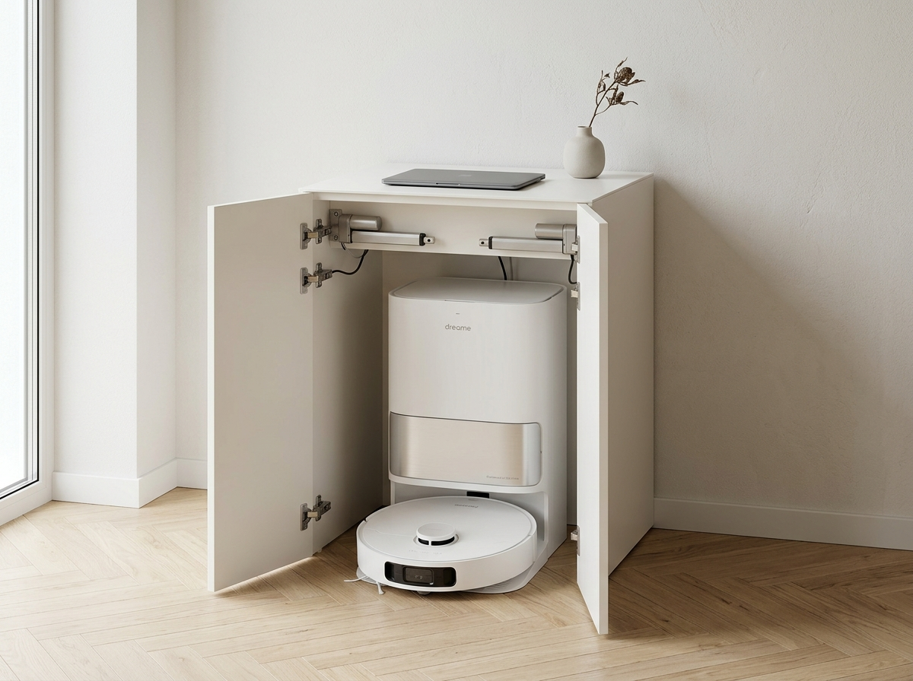
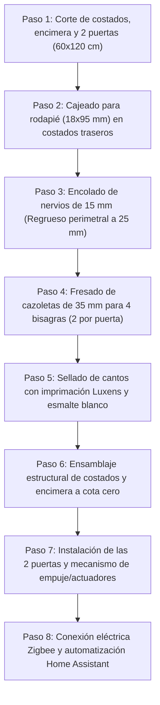

# Mueble Recibidor Automatizado a Cota Cero para Robot Aspirador

Consola de entrada cuadrada y minimalista a medida diseñada para ocultar la estación de autovaciado y robot aspirador **Dreame (L10s / X40)** a **Cota Cero**, con sistema de **doble puerta batiente motorizada** con actuadores que abren hacia delante, interior 100% diáfano (sin balda) y control nativo por **Zigbee (Home Assistant)**.



---

## 1. Fotografía de Referencia del Nuevo Diseño

* **Fotografía Principal (Doble Puerta Abierta hacia delante)**: [`foto_realista_mueble_cuadrado_dos_puertas.jpg`](foto_realista_mueble_cuadrado_dos_puertas.jpg)
  * Muestra la encimera cuadrada de $54 \times 54\text{ cm}$, las dos puertas batientes abiertas a $90^\circ - 100^\circ$ hacia delante mediante actuadores interiores, el robot Dreame saliendo por el centro a Cota Cero, el interior diáfano sin balda y el mueble pegado a la pared salvando el rodapié de $1,5\text{ cm}$.

---

## 2. Dimensiones Generales Recalculadas (Encimera Cuadrada)

Para cumplir la condición de **hacer el mueble todo lo estrecho posible con encimera cuadrada ($Ancho = Fondo$)**, la cota viene fijada por la profundidad de la aspiradora:

| Cota | Medida | Justificación Técnica y Holguras |
| :--- | :---: | :--- |
| **Encimera (Planta Cuadrada)**| **$540 \times 540\text{ mm}$** | Planta simétrica perfecta ($54\text{ cm}$ de ancho por $54\text{ cm}$ de fondo). |
| **Alto exterior** | **750 mm** | Altura esbelta de consola recibidor bajo cintura. |
| **Cajeado trasero (Rodapié)** | **$18\text{ mm}$ (fondo) $\times 95\text{ mm}$ (alto)** | Vaciado inferior trasero en ambos costados para encajar el zócalo de pared de $15\text{ mm}$ y pegar el mueble 100% a la pared. |
| **Fondo interior útil libre** | **522 mm** | Desde la pared hasta la cara interior de las puertas cerradas ($540 - 18\text{ mm}$ puerta). |
| **Posición estación Dreame** | **508 mm desde pared** | $15\text{ mm}$ (rodapié) $+ 493\text{ mm}$ (estación con rampa y robot acoplado). |
| **Margen frontal libre** | **+14 mm libres** | **La aspiradora NO queda pegada a las puertas** (queda $1,4\text{ cm}$ de separación entre la rampa y las puertas). |
| **Ancho interior libre** | **490 mm** | $540 - 50\text{ mm}$ (costados regruesados a 25 mm). La base Dreame mide $423\text{ mm}$ $\to$ **$33,5\text{ mm}$ libres por lado**. |
| **Altura interior diáfana** | **725 mm libres** | **Sin balda interior**: Espacio único y continuo de suelo a techo. |
| **Margen superior para tapas** | **+157 mm libres** | Sobre los $568\text{ mm}$ de la estación, para abrir las tapas y extraer los depósitos de agua hacia arriba sin mover el mueble. |
| **Puertas frontales (x2 hojas)**| **$268 \times 723\text{ mm}$ cada una** | Dos hojas batientes que abren hacia delante, dejando 2 mm de holgura con el suelo para girar libremente. |

---

## 3. Componentes Comprados y su Aprovechamiento

### 3.1. Tableros de Contrachapado Comprados
* **5x Tablero contrachapado crudo $60 \times 120 \times 1,0\text{ cm}$**
* **2x Tablero contrachapado crudo $60 \times 120 \times 1,5\text{ cm}$**

#### Despiece optimizado sobre las láminas de $60 \times 120\text{ cm}$:
1. **Lámina 1 (10 mm)**: Costado izquierdo (**$725 \times 522\text{ mm}$**).
   * *Justificación de fondo ($522\text{ mm}$)*: Costado ($522\text{ mm}$) + Puerta cerrada ($18\text{ mm}$) = **$540\text{ mm}$** (enrasa a la perfección bajo la encimera de $540\text{ mm}$).
2. **Lámina 2 (10 mm)**: Costado derecho (**$725 \times 522\text{ mm}$**).
3. **Lámina 3 (10 mm)**: Encimera cuadrada (**$540 \times 540\text{ mm}$**).
4. **Lámina 4 (10 mm)**: **Puerta izquierda ($268 \times 723\text{ mm}$) + Puerta derecha ($268 \times 723\text{ mm}$)**.
   * *Ambas puertas caben juntas en un solo tablero*: $268 + 4 + 268 = 540\text{ mm} \le 600\text{ mm}$, y $723\text{ mm} \le 1200\text{ mm}$.
5. **Lámina 5 (10 mm)**: **Tablero de reserva completo** (la balda interior y la guillotina se han eliminado).
6. **Láminas de 15 mm (2 uds)**: Se cortan en tiras longitudinales de **$50\text{ mm}$ de ancho** para regruesar los cantos perimetrales a 25 mm.

### 3.2. Pintura y Acabado
* **1x Imprimación universal LUXENS 1 L** (2 manos en cantos cortados como tapaporos/sellador + 1 mano general).
* **1x Esmalte ecológico TITANLUX blanco satinado 750 ml** (2 manos de acabado sedoso y lavable).

### 3.3. Automatización y Herrajes
* **Actuadores lineales 12V DC**: Conectados mecánicamente a las puertas para empujarlas hacia delante en la apertura.
* **1x Módulo Relé Inteligente ZigBee 2 Canales MHCOZY** (85-250V AC / 5V USB, contactos secos en modo *Interlock*).
* **1x Fuente de alimentación 12V DC**.
* **4x Bisagras de cazoleta de gran apertura ($165^\circ$)**: 2 bisagras por puerta, embutidas en el regrueso de 15 mm.

---

## 4. Esquema de Cotas en Alzado y Planta

### 4.1. Alzado Frontal (Puertas Abiertas hacia delante)

```
                     540 mm (Ancho Exterior)
                     490 mm (Hueco Interior Libre)
        <------------------------------------------------>
        +----+--------------------------------------+----+  ^
        |    |       ENCIMERA CUADRADA (25 mm)      |    |  |
        | 25 |                                      | 25 |  |
        | mm |                                      | mm |  |
        |    |                                      |    |  |
        | c  |    ESPACIO DIÁFANO SUPERIOR (157 mm) | c  |  | 750 mm
        | o  |     (Apertura libre de depósitos)    | o  |  | (Alto Total)
        | s  |                                      | s  |  |
        | t  + - - - - - - - - - - - - - - - - - - -+ t  |  |
        | a  |                                      | a  |  |  ^
        | d  |         BASE DREAME                  | d  |  |  |
        | o  |         (Ancho: 423 mm)              | o  |  |  | 568 mm (Alto Base)
        |    |         [Holgura: 33.5 mm por lado]  |    |  |  |
        | I  |                                      | D  |  |  |
        | z  |            ROBOT Ø350 mm             | e  |  |  |
  [Pta] | q  |          (Sale por el centro)        | r  |  |  |
 [Izquierda] +======================================+ [Pta Derecha] Suelo (Cota Cero)
```

### 4.2. Planta Superior (Corte de Profundidad contra la Pared)

```
                 Pared con Rodapié de 15 mm
============================================================= ^
|| [Cajeado 18x95]                         [Cajeado 18x95] || |
||<- Costado Izq (522 mm fondo)     Costado Der (522 mm) ->|| |
||                                                         || |
||         +-------------------------------------+         || |
||         |  Base Dreame apoyada en rodapié     |         || | 522 mm
||         |  (Fondo total con rampa: 493 mm)    |         || | (Fondo costados)
||         |  [Posición frontal: 508 mm]         |         || |
||         |                                     |         || |
||         |            ROBOT Ø350 mm            |         || |
||         +-------------------------------------+         || |
||                                                         || v
||<·············· Margen libre frontal: 14 mm ············>|| === Frente costados
||===========================|=============================|| ^ 18 mm (Puertas)
       Puerta Izquierda               Puerta Derecha          v
        (268 mm ancho)                 (268 mm ancho)
<---------------------- 540 mm exterior -------------------->
<------------ 540 mm fondo total (Encimera cuadrada) ------->
```

---

## 5. Procedimiento de Fabricación Paso a Paso



1. **Despiece y Cajeado de Rodapié**:
   * Corta los 2 costados a **$725 \times 522\text{ mm}$** y la encimera a **$540 \times 540\text{ mm}$**.
   * En la esquina inferior trasera de ambos costados, realiza con caladora el cajeado de **$18\text{ mm}$ de profundidad $\times 95\text{ mm}$ de altura** para librar el zócalo de la pared.
   * Corta las 2 puertas a **$268 \times 723\text{ mm}$** del tablero 4.
2. **Nervios de Regrueso a 25 mm**:
   * Encola tiras de $50\text{ mm}$ de ancho (tablero de 15 mm) en el perímetro interior de los costados, encimera y bordes de bisagra de ambas puertas.
   * Pasa lija P150 por los cantos para dejarlos enrasados y uniformes como un bloque de 25 mm.
3. **Fresado de Cazoletas de Bisagras**:
   * Con broca Forstner de 35 mm, fresa 2 cazoletas por puerta a 12 mm de profundidad sobre el nervio de 15 mm. Al tener 25 mm de espesor compuesto, no hay riesgo de perforar el frente.
4. **Tratamiento y Pintura**:
   * 2 manos de imprimación LUXENS en cantos cortados (como tapaporos) con lija P240 intermedia.
   * 1 mano general a todo el mueble y 2 manos de esmalte TITANLUX blanco satinado.
5. **Montaje e Instalación**:
   * Une los 2 costados y la encimera superior formando el puente estructural en "U" invertida.
   * Coloca el mueble pegado a la pared encajando el cajeado en el rodapié.
   * Monta las 2 puertas con las bisagras de $165^\circ$.
   * Conecta los actuadores en el interior para abrir automáticamente ambas puertas hacia delante cuando la aspiradora vaya a limpiar.
6. **Conexión Eléctrica ZigBee y Home Assistant**:
   * Configura el relé MHCOZY de 2 canales en modo **Interlock** (enclavamiento mutuo) para evitar activación simultánea de apertura y cierre.
   * Conecta la fuente de 12V DC a los contactos COM/NO/NC configurando inversión de polaridad (puente en H) con ambos actuadores cableados en paralelo.
   * En Home Assistant, crea la automatización: al pasar la entidad de la Dreame a `cleaning`, activa el Canal 1 (abrir puertas); al volver a `docked` y transcurrir 15 segundos, activa el Canal 2 (cerrar puertas).
