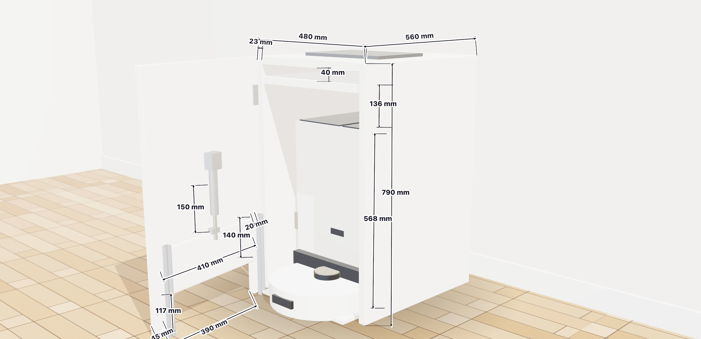
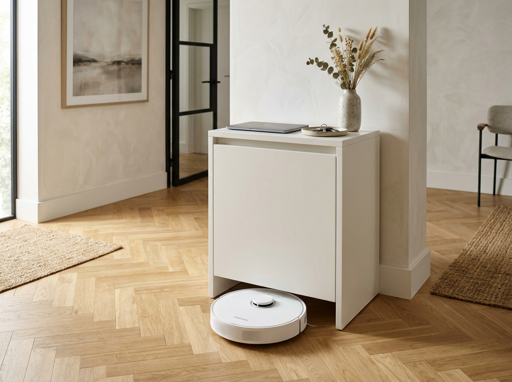
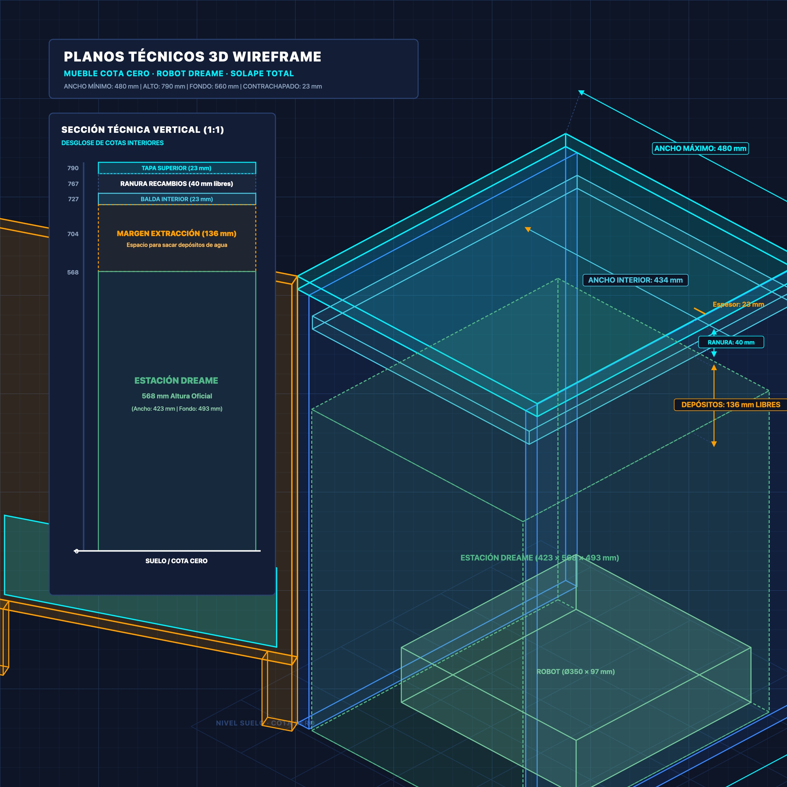

# Mueble Recibidor Automatizado a Cota Cero para Robot Aspirador

Consola de entrada minimalista a medida diseñada para ocultar la estación de autovaciado y robot aspirador **Dreame (L10s / X40)** a **Cota Cero**, con compuerta tipo guillotina automatizada mediante **Micro Actuador Lineal 12V** y control nativo por **Zigbee (Home Assistant)**.


---

## Características Principales

* **Cota Cero Real**: Sin suelo, traviesas ni zócalos. El robot sale y entra rodando directamente sobre el suelo de la estancia sin desniveles ni rampas añadidas.
* **Compuerta Guillotina Oculta**: Panel deslizante interior guiado por rieles en "U" de aluminio que sella el vano inferior ($390 \times 117\text{ mm}$) acústica y visualmente cuando el robot está en reposo.
* **Automatización Zigbee 3.0**: Módulo relé inteligente de 2 canales en modo *Interlock* (puente en H) para inversión de giro, integración directa con Home Assistant (Zigbee2MQTT / ZHA) y apertura/cierre automático según estado de limpieza.
* **Construcción Ultraligera y Rígida**: Estructura de contrachapado de 10 mm reforzada perimetralmente con nervios de 15 mm ($50\text{ mm}$ de ancho), logrando cantos vistos de **25 mm**, peso total de apenas **$\approx 8,5\text{ kg}$** y fondo sólido para embutir cazoletas de bisagras estándar de $\varnothing 35\text{ mm}$.
* **Ergonomía Superior**: Ranura útil superior de 40 mm para accesorios/mopas y margen de 132 mm sobre la base para abrir tapas y extraer depósitos de agua limpia/sucia cómodamente sin mover el mueble.

---

## Galería de Vistas y Planos

| Vista Realista en Recibidor | Render 3D con Cotas Técnicas |
| :---: | :---: |
|  |  |

| Variante Puerta Suspendida | Plano Técnico Wireframe CAD |
| :---: | :---: |
|  |  |

---

## Dimensiones Generales

| Cota | Medida | Notas |
| :--- | :---: | :--- |
| **Ancho exterior** | **480 mm** | $430\text{ mm}$ libres interiores (base Dreame mide 423 mm). |
| **Alto exterior** | **790 mm** | Altura perfecta de consola recibidor bajo cintura. |
| **Fondo exterior** | **560 mm** | Alberga los 493 mm de la base con rampa + cableado trasero + herrajes. |
| **Vano paso robot** | **390 x 117 mm** | Holgura de 20 mm por lado y superior respecto a robot Ø350 mm / 97 mm alto. |
| **Compuerta guillotina**| **410 x 140 mm** | Panel interior de 10 mm guiado en rieles de aluminio de 20 mm. |

---

## Lista de Materiales Comerciales (BOM)

### 1. Tableros y Carpintería
* **5x** Tablero de contrachapado crudo $60 \times 120 \times 1,0\text{ cm}$ (Paneles base estructurales).
* **2x** Tablero de contrachapado crudo $60 \times 120 \times 1,5\text{ cm}$ (Nervios perimetrales de regrueso a 25 mm).
* **1x** Imprimación universal LUXENS 1 L (usada como sellador/tapaporos en cantos y caras).
* **1x** Esmalte de interior ecológico TITANLUX blanco satinado 750 ml (RAL 9010).
* Cola blanca de carpintero (D3) para ensamblado de nervios.

### 2. Automatización y Mecanismo
* **1x** Micro Actuador Lineal Eléctrico Mini 12V DC, carrera 150 mm, fuerza 150N (formato tubular cilíndrico $< 35\text{ mm}$ de fondo).
* **1x** Módulo Relé Inteligente ZigBee 2 Canales MHCOZY (85-250V AC / 5V USB con contactos secos).
* **1x** Fuente de alimentación 230V AC a 12V DC (2A / 24W).
* **2x** Perfiles en "U" de aluminio anodizado $20 \times 15 \times 1,5\text{ mm}$ (longitud $280\text{ mm}$).
* **2x** Bisagras de cazoleta gran angular $165^\circ - 170^\circ$ solape total (cazoleta $\varnothing 35\text{ mm}$).
* **2x** Escuadras metálicas de montaje con pasador / tornillo para el actuador.

---

## Esquema de Conexiones Eléctricas (Puente en H)

```
                       +--------------------------------+
                       |  MHCOZY ZIGBEE 2 CANALES       |
Alimentación 230V AC   |  (Modo Interlock Activado)     |
o Micro-USB 5V ------->|                                |
                       +--------------------------------+
                                  |          |
                           Relé 1 (Subir)   Relé 2 (Bajar)
                           [NO1] [COM1] [NC1]  [NO2] [COM2] [NC2]
                             |     |     |       |     |     |
Fuente 12V (+) ──────────────+─────┼─────┼───────+     |     |
Fuente 12V (-) ────────────────────┼─────+─────────────┼─────+
                                   |                   |
Actuador Cable 1 (Rojo) ───────────+                   |
Actuador Cable 2 (Negro) ──────────────────────────────+
```

* **Relé 1 ON**: Sube la compuerta ($10\text{ segundos}$).
* **Relé 2 ON**: Baja la compuerta hasta cota cero.
* **Ambos OFF**: Motor desenergizado, freno activo, consumo 0W en reposo.

---

## Documentación Completa

Para acceder al desglose pormenorizado, planos de tolerancias y despiece paso a paso:

* [Especificaciones Técnicas y Constructivas (`docs/especificaciones_tecnicas.md`)](docs/especificaciones_tecnicas.md)
* [Planos Técnicos y Esquemas de Cotas (`docs/planos_cotas.md`)](docs/planos_cotas.md)
* [Visor 3D Interactivo WebGL (`render_3d_photorealistic.html`)](render_3d_photorealistic.html)
