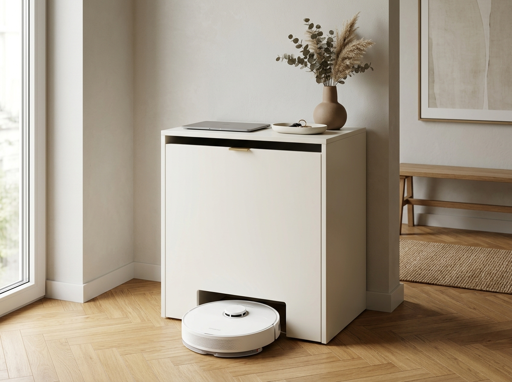
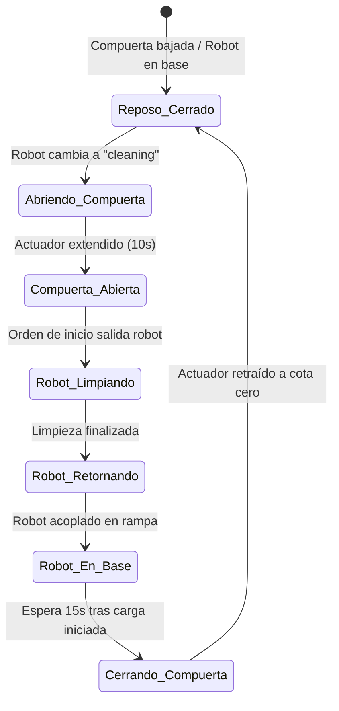

# Especificaciones Técnicas y Constructivas: Mueble Recibidor para Robot Aspirador

Proyecto de consola recibidor a medida diseñada para ocultar la estación de autovaciado y robot aspirador **Dreame L10s / X40** a **Cota Cero**, integrando una compuerta vertical tipo guillotina automatizada mediante actuador lineal de 12V y relé inteligente Zigbee de 2 canales.



---

## 1. Dimensiones Generales del Mueble

| Cota | Medida | Justificación Técnica |
| :--- | :--- | :--- |
| **Ancho exterior** | **480 mm** | Mínimo imprescindible para alojar la base Dreame (423 mm) con holgura lateral holgada. |
| **Alto exterior** | **790 mm** | Altura máxima estricta de consola recibidor (por debajo de la cintura), alojando base (568 mm), extracción de agua (136 mm), balda (25 mm compuesto), ranura útil (40 mm) y encimera (25 mm compuesto). |
| **Fondo exterior** | **560 mm** | Profundidad óptima para albergar la rampa de la base (493 mm), holgura de cableado trasero (20 mm) y herrajes de compuerta en la puerta (47 mm). |
| **Técnica constructiva**| **10 mm + 15 mm** | Paneles base de contrachapado de 10 mm con **nervios perimetrales de 15 mm** ($50\text{ mm}$ de ancho), logrando cantos vistos de **25 mm**, peso total ultraligero ($\approx 8,5\text{ kg}$) y resistencia estructural. |

---

## 2. Arquitectura Interior y Cota Cero

### 2.1. Cota Cero (Sin Suelo ni Zócalo)
* **Estructura autoportante de 3 lados**: El mueble consta de dos costados laterales y una encimera superior.
* **Ausencia total de suelo o zócalo**: No existe tablero inferior, traviesa ni plinto. El parqué de la habitación (espiga de roble) continúa de forma ininterrumpida dentro del mueble.
* **Sin trasera**: Abierto por detrás contra la pared para ventilación del sistema de vaciado, salida de cables al enchufe y librar el rodapié de la vivienda sin descuadrar el fondo.

### 2.2. Distribución Vertical Milimétrica

```
+-------------------------------------------------------+  Y = 790 mm (Encimera superior)
|             ENCIMERA SUPERIOR (Compuesto 25 mm)       |
+-------------------------------------------------------+  Y = 765 mm
|       RANURA SUPERIOR DE ACCESORIOS (40 mm libres)    |  (Mopas planas, bayetas)
+-------------------------------------------------------+  Y = 725 mm
|              BALDA INTERIOR (Compuesto 25 mm)         |
+-------------------------------------------------------+  Y = 700 mm
|                                                       |
|   ESPACIO LIBRE PARA EXTRACCIÓN DEPÓSITOS (132 mm)    |  (Apertura superior de tapas)
|                                                       |
+ - - - - - - - - - - - - - - - - - - - - - - - - - - - +  Y = 568 mm (Cota superior base Dreame)
|                                                       |
|                                                       |
|             ESTACIÓN BASE DREAME                      |
|             (Alto: 568 mm | Ancho: 423 mm)            |
|             [Hueco libre interior: 430 mm]            |
|                                                       |
+=======================================================+  Y = 0 mm (Suelo de la estancia / Cota Cero)
```

* **Superficie superior (Encimera)**: Destinada a portátil cerrado y elementos decorativos de entrada.
* **Ranura superior (40 mm)**: Espacio útil estrecho para recambios de mopas, bolsas y accesorios planos.
* **Margen de depósitos (132 mm)**: Altura libre entre la parte superior de la base (568 mm) y la balda interior (700 mm), permitiendo pivotar la tapa de la estación y retirar verticalmente los tanques de agua sin interferencia.

---

## 3. Puerta y Mecanismo de Compuerta Guillotina

### 3.1. Puerta Principal (Solape Total)
* **Dimensiones**: $480\text{ mm}$ (ancho) $\times 790\text{ mm}$ (alto).
* **Construcción**: Panel de contrachapado de 10 mm con nervio de 15 mm en montantes laterales ($10 + 15 = 25\text{ mm}$ espesor perimetral).
* **Bisagras**: 2 bisagras ocultas de cazoleta de **gran apertura ($165^\circ - 170^\circ$)** montadas en el montante izquierdo. Al disponer de 25 mm de espesor en el nervio, el fresado de la cazoleta ($\varnothing 35\text{ mm}$, profundidad 12 mm) se realiza con total seguridad sin perforar la cara vista exterior.
* **Vano inferior del robot**: Cajeado en "U" invertida que inicia **directamente en el suelo (Cota Cero)**:
  * **Ancho del vano**: **390 mm** (el robot mide Ø350 mm; holgura lateral de $+20\text{ mm}$ por lado).
  * **Alto del vano**: **117 mm** (el robot mide 97 mm de alto con torreta LiDAR; holgura superior de $+20\text{ mm}$).
  * **Montantes laterales**: **45 mm** a cada lado llegando hasta el suelo ($45 + 390 + 45 = 480\text{ mm}$).

### 3.2. Compuerta Deslizante (Panel Interior)
* **Dimensiones**: $410\text{ mm}$ (ancho) $\times 140\text{ mm}$ (alto) $\times 10\text{ mm}$ (espesor de contrachapado simple sin regrueso).
* **Solape perimetral**: Solapa $10\text{ mm}$ por lado sobre los montantes de la puerta ($390 + 20 = 410\text{ mm}$) y $23\text{ mm}$ por la parte superior sobre el vano ($117 + 23 = 140\text{ mm}$).
* **Posición bajada (reposo)**: Descansa a ras de suelo sellando visual y acústicamente el vano del robot.
* **Posición alzada (salida/entrada)**: El actuador eleva el panel $125\text{ mm}$, dejando el vano de $117\text{ mm}$ completamente libre hasta el suelo.

### 3.3. Rieles Guía de Aluminio
* **Perfil**: Perfil en "U" de aluminio extruido $20\text{ mm}$ (ancho) $\times 15\text{ mm}$ (alas) $\times 1.5\text{ mm}$ (pared).
* **Hueco interior libre**: $17\text{ mm}$ (permite deslizar el tablero de $10\text{ mm}$ con holgura suave).
* **Longitud de los rieles**: **280 mm**, atornillados verticalmente sobre los nervios de 15 mm de la puerta (tornillos de $15-18\text{ mm}$ con agarre firme).
* **Interior rieles**: Fieltro o teflón adhesivo de 1 mm para deslizamiento suave e insonoro.

### 3.4. Micro Actuador Lineal 12V DC
* **Modelo**: Micro Actuador Lineal Eléctrico Mini 150N 150mm 12V (formato cilíndrico delgado).
* **Carrera (*Stroke*)**: **150 mm**.
* **Fuerza**: **150 N** (sobrado para levantar la trampilla de 400 g).
* **Velocidad**: $\approx 12 - 15\text{ mm/s}$ (tiempo de maniobra completa: $\approx 10\text{ segundos}$).
* **Profundidad/Grosor**: $< 35\text{ mm}$ (entra holgado dentro de los 47 mm de espacio libre entre la puerta y la base Dreame).
* **Finales de carrera**: Integrados internos en ambos extremos (corte automático al llegar al tope).

---

## 4. Despiece y Aprovechamiento de Láminas ($60 \times 120\text{ cm}$)

### 4.1. Láminas de 10 mm (Paneles base)
* **Lámina 1**: Costado izquierdo ($765 \times 535\text{ mm}$) + Retal de corte para la **compuerta guillotina** ($410 \times 140\text{ mm}$).
* **Lámina 2**: Costado derecho ($765 \times 535\text{ mm}$).
* **Lámina 3**: Encimera superior ($535 \times 480\text{ mm}$) + Balda interior ($530 \times 430\text{ mm}$).
* **Lámina 4**: Puerta principal ($790 \times 480\text{ mm}$).
* **Lámina 5**: Lámina de seguridad / margen para imprevistos.

### 4.2. Láminas de 15 mm (Nervios de regrueso)
* **Láminas 1 y 2**: Se cortan longitudinalmente en tiras de **$50\text{ mm}$ de ancho** ($1200\text{ mm}$ de largo).
  * Salen hasta 11 tiras por tablero ($13,2\text{ metros lineales}$ por lámina).
  * Se encolan enrasadas al perímetro interior de costados, encimera y puerta para formar el regrueso a 25 mm.

### 4.3. Lista de Piezas Cortadas

| Pieza | Cant. | Grosor Base | Medida ($X \times Y$) | Función / Ensamblaje |
| :--- | :---: | :---: | :---: | :--- |
| **Costados laterales** | 2 | 10 mm (+15 nervio) | **$535 \times 765\text{ mm}$** | Laterales portantes a suelo. |
| **Encimera superior** | 1 | 10 mm (+15 nervio) | **$480 \times 535\text{ mm}$** | Tapa superior apoyada en testas de costados. |
| **Balda interior** | 1 | 10 mm (+15 nervio) | **$430 \times 530\text{ mm}$** | Balda fija sobre estación Dreame. |
| **Puerta principal** | 1 | 10 mm (+15 nervio) | **$480 \times 790\text{ mm}$** | Puerta batiente con vano $390 \times 117\text{ mm}$ a cota cero. |
| **Compuerta guillotina**| 1 | 10 mm (simple) | **$410 \times 140\text{ mm}$** | Panel deslizante de cierre de vano. |
| **Nervios perimetrales**| ~10 | 15 mm | **$50\text{ mm} \times \text{longitud}$** | Encolados perimetrales de refuerzo. |

---

## 5. Lista de Materiales y Herrajes (BOM Comercial)

1. **Tableros de Contrachapado Crudo**:
   * 5x Tablero contrachapado $60 \times 120 \times 1,0\text{ cm}$ (Leroy Merlin Ref. 11034261).
   * 2x Tablero contrachapado $60 \times 120 \times 1,5\text{ cm}$ (Leroy Merlin Ref. 11034282).
2. **Pintura y Acabado**:
   * 1x Imprimación universal LUXENS 1 L (usada como sellador/tapaporos en cantos y base).
   * 1x Esmalte de interior ecológico TITANLUX blanco satinado 750 ml (RAL 9010).
3. **Mecanismo y Automatización**:
   * 1x Micro actuador lineal 12V DC, 150N, carrera 150 mm (mini tubular).
   * 1x Módulo relé inteligente ZigBee de 2 canales MHCOZY (85-250V AC / 5V USB, contactos secos).
   * 1x Fuente de alimentación 230V AC $\to$ 12V DC (2A / 24W).
   * 2x Rieles en "U" de aluminio $20 \times 15 \times 1,5\text{ mm}$ ($280\text{ mm}$ de largo).
   * 2x Bisagras de cazoleta gran angular $165^\circ - 170^\circ$ solape total (cazoleta $\varnothing 35\text{ mm}$).
   * 2x Escuadras de montaje con pasador / tornillo M6 para los anclajes del actuador.

---

## 6. Esquema de Cableado y Lógica Zigbee

### 6.1. Cableado en Puente en H (Polaridad Invertida con Relé 2CH)

El módulo MHCOZY 2CH se alimenta directamente de 230V AC o USB 5V. Las salidas de relé son contactos secos que conmutan los 12V hacia el motor:

```
                  +--------------------------------+
                  |  MHCOZY ZIGBEE 2 CANALES       |
Alimentación 230V |  (Modo Interlock Activado)     |
o USB 5V -------->|                                |
                  +--------------------------------+
                             |          |
                      Relé 1 (Subir)   Relé 2 (Bajar)
                      [NO1] [COM1] [NC1]  [NO2] [COM2] [NC2]
                        |     |     |       |     |     |
Fuente 12V (+) ─────────+─────┼─────┼───────+     |     |
Fuente 12V (-) ───────────────┼─────+─────────────┼─────+
                              |                   |
Actuador Cable 1 (Rojo) ──────+                   |
Actuador Cable 2 (Negro) ─────────────────────────+
```

* **Relé 1 ON (Relé 2 OFF)**: COM1 recibe (+) y COM2 recibe (-) $\to$ **Actuador extiende / Compuerta sube**.
* **Relé 2 ON (Relé 1 OFF)**: COM1 recibe (-) y COM2 recibe (+) $\to$ **Actuador retrae / Compuerta baja**.
* **Ambos OFF**: Ambos polos a masa (-) $\to$ **Motor parado, freno activo, consumo 0W**.

### 6.2. Automatización en Home Assistant


